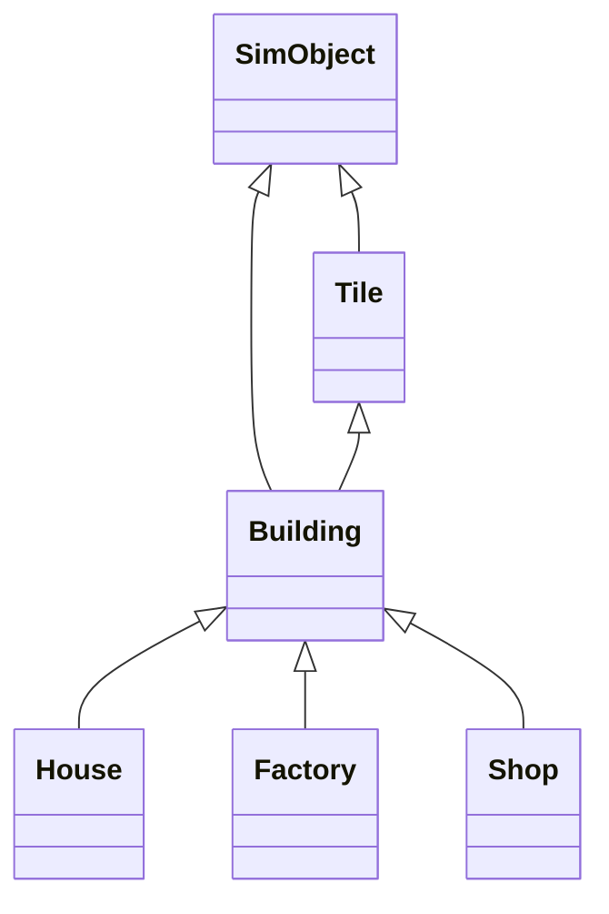

# Simcity threejs version

> by:hexianWeb

# Threejs 游戏基建结构（项目结构重构版）

| 要素         | 作用             | 类比现实                       |
| ------------ | ---------------- | ------------------------------ |
| **Scene**    | 游戏世界的3D环境 | 就像游乐场的场地               |
| **Game UI**  | 用户界面和交互层 | 相当于游乐场的指示牌和售票处   |
| **Metadata** | 游戏数据和逻辑   | 类似游乐场的运营规则和游客数据 |

# SimObject  互动基类

> 提供了 mesh 管理、选中高亮、HTML 信息展示等通用交互能力。

- SimObject 提供了 mesh 管理、选中高亮、HTML 信息展示等通用交互能力。

- 只要是场景中可交互的对象（如 Tile、Building），都应继承 SimObject。

# building 类组件

## 🧠 分析与设计思路

1. 单一职责原则

- Tile 只负责地皮格子的表现和状态，不关心建筑的具体逻辑。

- Building 负责建筑的加载、表现、升级、功能（如产出人口、电力、经济等）。

1. 多态与扩展性

- 不同类型建筑继承自 Building，重写各自的功能方法（如 getPopulation、getPower、getEconomy）。

- 便于后续扩展新建筑类型或功能。

1. 解耦与协作

- Tile 只持有 Building 的实例（如 this.buildingInstance），通过接口与其交互。

- Building 需要能访问 Experience、scene、resources 等核心实例。

------

## 推荐实现步骤

### 1. 新建 building.js 基础类

- 负责加载建筑模型、通用属性（如 position、direction）、升级等。

- 提供通用接口（如 update、upgrade、get功能值等）。

### 2. 新建具体建筑子类（如 house.js、factory.js、shop.js）

- 继承 Building，重写/扩展功能方法。

### 3. 修改 Tile 类

- Tile 只负责地皮表现，持有 Building 实例。

- 通过接口与 Building 交互（如升级、获取功能值等）。



# Tile/Building 结构与交互机制（基于当前项目实现）

## 1. Tile 类结构与职责

### 1.1 结构说明

- **Tile** 代表单个地皮格子，继承自 `SimObject`，是场景中所有地皮的基础单元。
- 每个 Tile 由三部分组成：
  - `grassMesh`：草地网格，基础地皮外观。
  - `groundMesh`：地面网格，叠加于 grassMesh 之上，通常用于区分不同地皮类型（如道路、建筑用地）。
  - `buildingInstance`：当前地皮上放置的建筑实例（如 House、Factory），为 Tile 的子对象。

#### 代码结构（见 `src/js/components/tiles/tile.js`）

```js
export default class Tile extends SimObject {
  constructor(x, y, { type = 'grass', building = null, direction = 0 } = {}) {
    // ...省略
    this.grassMesh = ... // 草地
    this.groundMesh = ... // 地面
    this.grassMesh.add(this.groundMesh)
    this.setMesh(this.grassMesh)
    this.buildingInstance = null
    // ...省略
  }

  setBuilding(type, direction = 0) {
    this.removeBuilding()
    const buildingInstance = createBuilding(type, direction, options)
    if (buildingInstance) {
      this.buildingInstance = buildingInstance
      this.grassMesh.add(buildingInstance)
    }
  }

  removeBuilding() {
    if (this.buildingInstance) {
      this.grassMesh.remove(this.buildingInstance)
      this.buildingInstance = null
    }
  }
  // ...省略
}
```

### 1.2 设计要点

- **父子关系**：Tile 作为父对象，buildingInstance 作为其子对象，所有交互和状态变更都以 Tile 为入口。
- **Mesh 结构**：grassMesh 是主 mesh，groundMesh 作为其子 mesh，buildingInstance 作为 grassMesh 的另一个子 mesh。
- **高亮/交互**：所有高亮、选中、悬停等交互效果都直接作用于 Tile，buildingInstance 会自动跟随父对象的状态变化。

---

## 2. 地皮与建筑的交互机制

### 2.1 交互入口

- 所有场景交互（如点击、悬停、选中、建造、拆除、搬迁）都只针对 Tile 实例进行。
- Tile 负责管理自身的 buildingInstance，任何建筑的增删改查都通过 Tile 的方法实现。

### 2.2 父子关系的优势

- **一致性**：Tile 作为唯一交互入口，避免了 Tile/Building 分离带来的状态同步和管理复杂度。
- **性能**：遍历/查找/批量操作时只需遍历 Tile 集合，无需额外维护映射表。
- **扩展性**：未来如地皮升级、建筑升级、地皮类型扩展等，都可在 Tile 内部集中管理。

---

## 3. UI 交互与状态同步

### 3.1 mitt 事件总线

- 用于 Three.js 层与 Vue UI 层的事件通信（如弹窗、提示、面板显示等）。
- 典型事件如：`building:placed`、`building:removed`、`ui:panel:show` 等。

### 3.2 Pinia 全局状态（`useGameState`）

- Vue 层通过 Pinia 管理全局状态（如当前模式、选中建筑类型、金币等）。
- Three.js 层通过 `useGameState()` 读取/更新这些状态，实现 UI 与场景的同步。
- 例如，建造建筑时会检查 `gameState.credits` 是否足够，放置后自动扣除金币并更新状态。

#### 代码片段（见 `src/js/tools/interactor.js`）

```js
const mode = this.gameState.currentMode
const buildingTypeToBuild = this.gameState.selectedBuilding
if (mode === 'build' && buildingTypeToBuild && !tile.buildingInstance) {
  tile.setBuilding(buildingTypeToBuild)
  this.gameState.updateCredits(-cost)
  // ...emit 事件通知 UI
}
```

### 3.3 交互流程

1. **UI 操作**（如点击建造按钮）→ 更新 Pinia 状态（如 `currentMode`、`selectedBuilding`）。
2. **Three.js 场景**（如 Interactor）监听 Pinia 状态变化，决定交互逻辑。
3. **场景交互**（如点击地皮）→ 操作 Tile（如 `setBuilding`），并通过 mitt 事件通知 UI 层（如弹出提示、刷新面板）。
4. **资源变更**（如金币扣除）→ 直接通过 Pinia 的 action 更新（如 `updateCredits`），UI 自动响应。

---

## 4. 典型交互场景梳理

### 4.1 建造模式

- UI 选择建筑类型，Pinia 更新 `selectedBuilding`。
- 鼠标点击空地 Tile，`tile.setBuilding(type)`，并通过 Pinia 扣除金币。
- mitt 事件通知 UI 弹出"建造成功"提示。

### 4.2 拆除模式

- 鼠标点击有建筑的 Tile，弹出确认框（mitt 事件）。
- 确认后，`tile.removeBuilding()`，Pinia 返还部分金币。
- mitt 事件通知 UI 弹出"拆除成功"提示。

### 4.3 搬迁模式

- 先选中有建筑的 Tile，再选中目标空地 Tile。
- 通过 Tile 的父子关系，将 buildingInstance 从源 Tile 移动到目标 Tile。
- mitt 事件通知 UI 弹出"搬迁成功"提示。

---

## 5. 总结与建议

- **Tile 是一切交互的核心**，所有建筑相关操作都通过 Tile 实现，避免了 Tile/Building 分离带来的复杂性。
- **UI 与场景解耦**，通过 mitt 事件和 Pinia 状态实现双向同步，既保证了响应式 UI，又便于场景逻辑的集中管理。
- **资源与状态管理**，金币等资源直接通过 Pinia 操作，确保数据一致性和易维护性。
- **后续扩展**，如地皮类型、建筑升级、批量操作等，都建议以 Tile 为中心进行设计和实现。

---

# 其余部分（如产出系统、策略机制等）保持原有内容，可根据后续实现继续细化。
