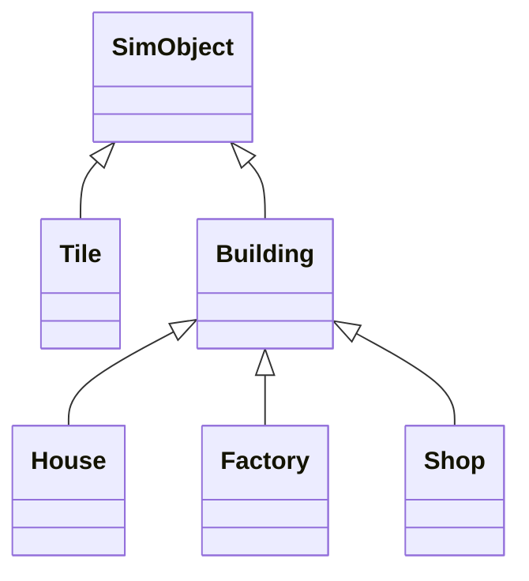

# Simcity threejs version

# SimObject  互动基类

> 提供了 mesh 管理、选中高亮、HTML 信息展示等通用交互能力。

- SimObject 提供了 mesh 管理、选中高亮、HTML 信息展示等通用交互能力。

- 只要是场景中可交互的对象（如 Tile、Building），都应继承 SimObject。

# building 类组件

## 🧠 分析与设计思路

1. 单一职责原则

- Tile 只负责地皮格子的表现和状态，不关心建筑的具体逻辑。

- Building 负责建筑的加载、表现、升级、功能（如产出人口、电力、经济等）。

1. 多态与扩展性

- 不同类型建筑继承自 Building，重写各自的功能方法（如 getPopulation、getPower、getEconomy）。

- 便于后续扩展新建筑类型或功能。

1. 解耦与协作

- Tile 只持有 Building 的实例（如 this.buildingInstance），通过接口与其交互。

- Building 需要能访问 Experience、scene、resources 等核心实例。

------

## 推荐实现步骤

### 1. 新建 building.js 基础类

- 负责加载建筑模型、通用属性（如 position、direction）、升级等。

- 提供通用接口（如 update、upgrade、get功能值等）。

### 2. 新建具体建筑子类（如 house.js、factory.js、shop.js）

- 继承 Building，重写/扩展功能方法。

### 3. 修改 Tile 类

- Tile 只负责地皮表现，持有 Building 实例。

- 通过接口与 Building 交互（如升级、获取功能值等）。



# Tile 地皮交互

## 1. 方案梳理

### 方案一：Tile 负责建筑实例

- 流程：射线检测命中 tile（地皮），直接调用 tile.userData.setBuilding('house', 0) 在 tile 内部生成建筑实例（如 House），并作为 tile 的子对象（mesh.add(buildingInstance)）。

- 特点：

- 建筑和地皮是父子关系，建筑始终附着在 tile 上。

- 交互、管理、拾取都通过 tile 进行。

- 删除/移动建筑时，直接操作 tile 实例。

### 方案二：Tile 和 Building 分离

- 流程：射线检测命中 tile，获取其 position.x/z，随后在 buildingsGroup（独立 group）中创建建筑实例，建筑与 tile 仅通过坐标关联。

- 特点：

- 地皮和建筑完全分离，建筑统一管理在 buildingsGroup。

- 需要额外的数据结构维护 tile 与 building 的映射关系。

- 移动/删除建筑时，需要先查找对应 tile，再操作 buildingsGroup。

------

## 2. 需求与扩展性分析

### PRD 需求

- 建筑与地皮一一对应，每个 tile 最多一个建筑。

- 需要支持建筑的放置、移动、删除。

- 未来可能有 tile 升级、建筑升级、地皮扩展等需求。

### 技术实现对比

| 维度       | 方案一（父子）             | 方案二（分离）               |
| :--------- | :------------------------- | :--------------------------- |
| 实现难度   | 简单，直接操作 tile        | 复杂，需维护映射关系         |
| 性能       | 高效，遍历 tile 即可       | 需遍历 buildingsGroup 或查表 |
| 扩展性     | 易于扩展（如 tile 升级）   | 灵活，但管理复杂             |
| 交互逻辑   | 直观，所有交互聚焦 tile    | 需同步 tile 与 building 状态 |
| 数据一致性 | 易保证（父子结构天然一致） | 需手动同步，易出错           |
| 未来扩展   | 支持 tile/建筑联动、升级等 | 支持建筑独立动画、批量操作等 |

### 代码风格与维护

- 你的框架强调通过 Experience 单例获取依赖，tile 作为地皮的核心单元，建筑作为 tile 的“内容”更符合直觉。

- 方案一更贴合“组合”思想，tile 作为容器，建筑作为内容，便于后续扩展 tile 的属性（如地皮类型、状态等）。

------

## 3. 推荐与理由

强烈推荐采用方案一（tile 负责建筑实例，建筑作为 tile 的子对象），理由如下：

1. 符合 PRD 需求：每个 tile 只允许一个建筑，tile 作为地皮的唯一管理者，建筑作为其内容，逻辑清晰。

1. 易于维护：所有操作（放置、删除、移动、升级）都只需操作 tile 实例，无需额外维护映射关系。

1. 高扩展性：未来如地皮扩展、建筑升级、tile 状态变化等，都可以在 tile 类中集中管理，便于统一调试和维护。

1. 性能优越：遍历 tile 即可获取所有建筑，无需遍历全场景或查找映射表。

1. 代码风格统一：符合你当前框架的单例与组件化设计，便于团队协作和后续开发。

------

## 4. 方案一的最佳实践建议

- tile.js 中的 setBuilding(type, direction) 方法负责创建/替换建筑实例，并将其作为 tile 的子对象。

- interactor.js 通过射线检测命中 tile 后，直接调用 tile.userData.setBuilding(...) 实现建筑放置。

- 建筑删除/移动：可在 tile 上实现 removeBuilding()、moveBuilding() 等方法，保持 tile 的唯一性和一致性。

- 建筑信息面板：通过 tile 统一获取建筑信息，便于展示和交互。

------

## 5. 方案二的适用场景

- 如果未来有建筑与 tile 多对多、建筑可跨 tile、建筑批量动画等需求，可以考虑方案二。但目前 PRD 明确是一一对应，方案一更优

# UI 交互

- UI 交互（如选择建筑、切换模式、点击地皮）目前只在前端 JS 层（index.js）和 HTML 层（index.html）生效。

- Three.js 场景中的建筑实际放置、删除、移动等操作由 tile/building 组件（如 tile.js、house.js）负责。

- 需要桥接：UI 事件 → Three.js 场景 & Three.js 场景 → UI 事件操作。

  - 用户在左侧面板选择建筑类型（如“FACTORY”）。

  - 用户切换到“BUILD”模式。

  - 用户点击画布（canvas）上的某个 tile，期望在该 tile 上放置所选建筑。

  - 用户切换到“DEMOLISH”模式，点击建筑，期望删除该建筑。

  - 用户点击建筑，右侧面板显示详细信息。

### 方案：mitt js 事件驱动（推荐）

- 全局状态：用  Experience 单例存储当前选中的建筑类型、操作模式。多用于 UI 事件 → Three.js 场景

  ```js
  export default class Experience extends EventEmitter {
    constructor(canvas) {
      super()
      // ...
      this.currentMode = 'build'
      this.selectedBuilding = null
      this.credits = 12345
      // ...
    }
  }
  ```

随后在 Ray 射线检测相关逻辑中读取全局变量相应状态并做不同逻辑操作

```js
// interactor.js
_onClick(_event) {
  if (this.focused) {
    if (this.experience.currentMode === 'build' && window.selectedBuilding) {
      this.focused.setBuilding(window.selectedBuilding)

    } else if (this.experience.currentMode === 'demolish') {
      this.focused.removeBuilding()
      // 可选：window.showToast('建筑已拆除')
    } else {
      // 显示信息面板
      const html = this.focused.toHTML()
      document.getElementById('info-panel').innerHTML = html
    }
  }
}
```

- 事件驱动：UI 事件只负责更新全局状态，Three.js 交互（如 Interactor）在射线命中 tile/building 时，读取全局状态并执行相应操作。Three.js 场景 → UI 事件

  ```js
  // experience.js / interactor.js
  import { eventBus } from './event-bus'
  eventBus.emit('building:placed', { tile, type })

  // index.js
  import { eventBus } from './event-bus'
  eventBus.on('building:placed', ({ tile, type }) => {
    showToast(`${type} 已放置在 (${tile.x}, ${tile.y})`, 'success')
    // ...刷新 UI
  })
  ```

## 典型需求场景

- 用户在左侧面板选择建筑类型（如“FACTORY”）。

- 用户切换到“BUILD”模式。

- 用户点击画布（canvas）上的某个 tile，期望在该 tile 上放置所选建筑。

- 用户切换到“DEMOLISH”模式，点击建筑，期望删除该建筑。

- 用户点击建筑，右侧面板显示详细信息

## 典型事件设计

### ① 建筑相关

| 事件名            | 触发时机               | 事件参数结构                     |
| :---------------- | :--------------------- | :------------------------------- |
| building:placed   | 成功放置建筑后         | { tile, type, buildingInstance } |
| building:removed  | 拆除建筑后             | { tile, type }                   |
| building:selected | 选中建筑（点击/hover） | { tile, type, buildingInstance } |
| building:upgraded | 建筑升级后             | { tile, type, level }            |

### ② 地皮/格子相关

| 事件名        | 触发时机   | 事件参数结构 |
| :------------ | :--------- | :----------- |
| tile:selected | 选中地皮   | { tile }     |
| tile:expanded | 地皮扩展后 | { newSize }  |

### ③ 模式/状态相关

| 事件名           | 触发时机                   | 事件参数结构 |
| :--------------- | :------------------------- | :----------- |
| mode:changed     | 操作模式切换（build/move） | { mode }     |
| building:choosed | 选择建筑卡片               | { type }     |

### ④ 资源/经济相关

| 事件名             | 触发时机 | 事件参数结构          |
| :----------------- | :------- | :-------------------- |
| credits:changed    | 金币变化 | { credits, delta }    |
| population:changed | 人口变化 | { population, delta } |

### ⑤ UI 相关

| 事件名        | 触发时机       | 事件参数结构      |
| :------------ | :------------- | :---------------- |
| ui:toast      | 需要弹出提示时 | { message, type } |
| ui:panel:show | 显示信息面板   | { panel, data }   |
