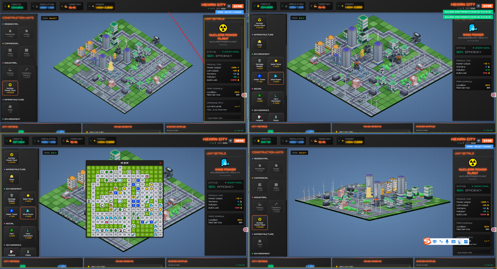
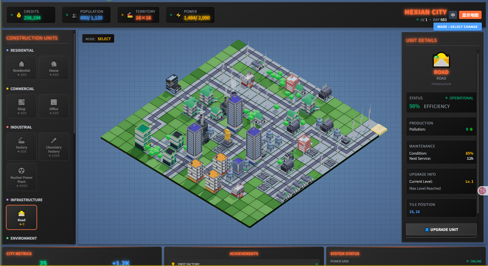
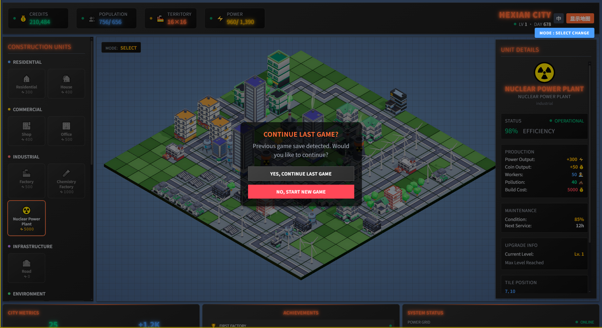

<a href="https://hellogithub.com/repository/hexianWeb/CubeCity" target="_blank"></a>

[English README](./README.en.md)

# 2.5D 卡通城市放置系统 (CubeCity)

> A lightweight 2.5D city-building simulation game based on Three.js and Vue.

Welcome to CubeCity! This is a cartoon-style 2.5D city simulation game where you can build, manage, and expand your very own metropolis. Place buildings, lay down roads, and watch your city grow as you manage resources and expand your territory.


## ✨ 核心功能

*   **🏙️ 自由建设:** 随心所欲地放置、移动和拆除各类建筑与道路，打造独一无二的城市景观。
*   **🧩 策略规划:** 平衡住宅 (R)、商业 (C)、工业 (I) 的发展，同时兼顾环境 (E)、社会 (S)、治理 (G) 的需求，实现城市可持续发展。
*   **💰 经济系统:** 建筑会自动产出金币，利用这些金币来建造新建筑、升级或扩展你的领地。
*   **💾 本地存储:** 你的城市进度会自动保存在本地，随时可以回来继续你的建设大业。
*   **🎨 卡通风味:** 明快的色彩和可爱的卡通模型，带来轻松愉悦的视觉体验。

| 界面总览                                     | 城市一隅                                       | 离线存储                                     |
| :------------------------------------------- | :--------------------------------------------- | :------------------------------------------- |
|  |  |  |

## 🎮 玩法介绍

游戏主要围绕四种操作模式展开，让你轻松管理城市的方方面面：

*   **🔍 选择模式 (SELECT):**
    *   点击建筑查看详细信息，如居民数量、状态、产出等。
    *   满足条件时可对建筑进行升级，提升其功能和产出。

*   **🏗️ 建造模式 (BUILD):**
    *   从左侧面板选择你想要的建筑。
    *   在地图上的可用地皮上点击即可放置建筑，实时预览模型和高亮提示让操作更直观。

*   **🚚 搬迁模式 (RELOCATE):**
    *   选中一个已建好的建筑，然后点击一个空地，即可轻松完成搬迁。
    *   在放置前，可以旋转建筑以适应你的城市布局。

*   **💣 拆除模式 (DEMOLISH):**
    *   切换到此模式，点击不再需要的建筑即可将其拆除。
    *   拆除建筑会返还部分建造成本。

## 🛠️ 技术栈

*   **核心渲染:** [Three.js](https://threejs.org/)
*   **前端框架:** [Vue 3](https://vuejs.org/)
*   **构建工具:** [Vite](https://vitejs.dev/)
*   **UI & 样式:** [Tailwind CSS](https://tailwindcss.com/) & SCSS
*   **状态管理:** [Pinia](https://pinia.vuejs.org/)
*   **事件总线:** [mitt](https://github.com/developit/mitt)

## 📚 文档

*   **🎮 新手指南:** [玩家游玩指南](./docs/新手指南.md) - 详细的游戏玩法说明和技巧
*   **👨‍💻 开发指南:** [新手开发指南](./docs/新手开发指南.md) - 完整的开发环境搭建和开发规范
*   **📋 产品需求:** [PRD 文档](./docs/PRD.md) - 产品需求文档
*   **🔧 技术设计:** [TD 文档](./docs/TD.md) - 技术设计文档

## 🚀 未来展望

我们计划在未来为游戏增加更多有趣的功能，包括：

*   **动态经济系统:** 市场需求会根据你的城市建筑比例动态变化。
*   **挑战与失败机制:** 引入破产、人口流失、环境崩溃等失败条件，增加游戏挑战性。
*   **策略性建筑系统:** 建筑之间将产生相互影响，考验你的规划能力。
*   **动态事件系统:** 随机发生经济危机、移民潮等事件，让城市管理充满变数。
*   **科技树与政策系统:** 解锁新技术，颁布新政策，从更高维度引导城市发展。

## 🧑‍💻 作者

Developed by [hexianWeb](https://github.com/hexianWeb).

## 💖 赞赏支持

如果这个项目对你有帮助，欢迎请作者喝杯咖啡，支持项目长期维护与更新：


## 📄 许可

This project is licensed under the [MIT License](LICENSE).

## 新功能：建筑状态轮循显示系统 🔄

### 功能特点

1. **智能分类展示**
   - **Debuff 优先**：当建筑存在问题状态时，优先轮循显示所有 debuff 状态
   - **Buff 候补**：当没有问题状态时，轮循显示所有增益状态
   - **平滑切换**：状态间采用淡入淡出动画，视觉体验流畅

2. **轮循机制**
   - 每 2.5 秒自动切换显示下一个状态
   - 单状态时静态显示，多状态时自动轮循
   - 支持实时状态变化响应

3. **状态分类**
   ```javascript
   DEBUFF: ['MISSING_ROAD', 'MISSING_POWER', 'MISSING_POPULATION', 'OVER_POPULATION', 'MISSING_POLLUTION']
   BUFF: ['POWER_BOOST', 'ECONOMY_BOOST', 'POPULATION_BOOST', 'COIN_BUFF', 'HUMAN_BUFF', 'UPGRADE']
   ```

### 使用示例

在建筑类中配置状态：

```javascript
this.statusConfig = [
  // === DEBUFF 状态（问题状态，优先轮循） ===
  {
    statusType: 'MISSING_ROAD',
    condition: (building, gs) => {
      building.buffConfig = { targets: ['road'] }
      return !building.checkForBuffTargets(gs)
    },
    effect: { type: 'missRoad', offsetY: 0.7 },
  },

  // === BUFF 状态（增益状态，无问题时轮循） ===
  {
    statusType: 'COIN_BUFF',
    condition: (building, gs) => {
      building.buffConfig = { targets: ['shop'], range: 1 }
      return building.checkForBuffTargets(gs)
    },
    effect: { type: 'coinBuff', offsetY: 0.7 },
  },
]
```

### 技术实现

- **状态管理**：从单状态改为多状态数组管理
- **定时轮循**：使用 `setInterval` 实现自动切换
- **动画优化**：专门的 `fadeOut` 方法确保切换流畅
- **内存安全**：完善的清理机制防止内存泄漏

参考实现：`src/js/components/tiles/buildings/park.js`
